Project Hadron Data Science Tools and Synthetic Feature Builder
###############################################################

.. class:: no-web no-pdf

.. contents:: Table of Contents

.. section-numbering::

Filling the Gap - Project Hadron
================================
Project Hadron has been built to bridge the gap between data scientists and data engineers. More specifically between
machine learning business outcomes and the final product.

Project Hadron is a core set of abstractions that are the foundation of the three key elements that represent data
science, those being: (1) feature engineering, (2) the construction of synthetic data with simulators, and generators
(3) and statistics and machine learning algorithms for discovery and creating models. Project Hadron uniquely sees
data as ‘all the same’ (lazyprogrammer (2020) https://lazyprogrammer.me/all-data-is-the-same/) , by which we mean
its origin, shape and size stay independent throughout the disciplines so its content, form and structure can be
removed as a factor in the design and implementation of the components built.

Project Hadron has been designed to place data scientists in the familiar environment of machine learning and
statistical tools, extracting their ideas and translating them automagicially into production ready solutions
familiar to data engineers and Subject Matter Experts (SME’s).

Project Hadron provides a clear separation of concerns, whilst maintaining the original intentions of the data
scientist, that can be passed to a production team. It offers trust between the data scientists teams and product
teams. It brings with it transparency and traceability, dealing with bias, fairness, and knowledge. The resulting
outcome provides the product engineers with adaptability, robustness, and reuse; fitting seamlessly into a
microservices solution that can be language agnostic.

Project Hadron is designed using Microservices. Microservices - also known as the microservice architecture - is an
architectural pattern that structures an application as a collection of component services that are:

* Highly maintainable and testable
* Loosely coupled
* Independently deployable
* Highly reusable
* Resilient
* Technically independent

Component services are built for business capabilities and each service performs a single function. Because they are
independently run, each service can be updated, deployed, and scaled to meet demand for specific functions of an
application. Project Hadron microservices enable the rapid, frequent and reliable delivery of large, complex
applications. It also enables an organization to evolve its data science stack and experiment with innovative ideas.

At the heart of Project Hadron is a multi-tenant, NoSQL, singleton, in memory data store that has minimal code and
functionality and has been custom built specifically for Hadron tasks in  mind. Abstracted from this is the component
store which allows us to build a reusable set of methods that define each tenanted component that sits separately
from the store itself. In addition, a dynamic key value class provides labeling so that each tenant is not tied to
a fixed set of reference values unless by specificity. Each of the classes, the data store, the component property
manager, and the key value pairs that make up the component are all independent, giving complete flexibility and
minimum code footprint to the build process of new components.

This is what gives us the Domain Contract for each tennant which sits at the heart of what makes the contracts
reusable, translatable, transferable and brings the data scientist closer to the production engineer along with
building a production ready component solution.

Main features
-------------

* Data Preparation
* Feature Selection
* Feature Engineering
* Feature Cataloguing
* Augmented Knowledge
* Synthetic Feature Build

Feature transformers
--------------------

Project Hadron is a Python library with multiple transformers to engineer and select features to use
across a synthetic build, statistics and machine learning.

* Missing data imputation
* Categorical encoding
* Variable Discretisation
* Outlier capping or removal
* Numerical transformation
* Redundant feature removal
* Synthetic variable creation
* Synthetic multivariate
* Synthetic model distributions
* Datetime features
* Time series

Project Hadron allows one to present optimal parameters associated with each transformer, allowing
different engineering procedures to be applied to different variables and feature subsets.

Background
----------
Born out of the frustration of time constraints and the inability to show business value
within a business expectation, this project aims to provide a set of tools to quickly build production ready
data science disciplines within a component based solution demonstrating coupling and cohesion between each
disipline, providing a separation of concerns between components.

It also aims to improve the communication outputs needed by ML delivery to talk to Pre-Sales, Stakholders,
Business SME's, Data SME's product coders and tooling engineers while still remaining within familiar code
paradigms.

Getting Started
===============
The ``discovery-transition-ds`` package is a set of python components that are focussed on Data Science. They
are a concrete implementation of the Project Hadron abstract core. It is build to be very light weight
in terms of package dependencies requiring nothing beyond what would be found in an basic Data Science environment.
Its designed to be used easily within multiple python based interfaces such as Jupyter, IDE or command-line python.

Installation
------------
The best way to install AI-STAC component packages is directly from the Python Package Index repository using pip.
All AI-STAC components are based on a pure python foundation package ``aistac-foundation``

.. code-block:: bash

    $ pip install aistac-foundation

The AI-STAC component package for the Transition is ``discovery-transition-ds`` and pip installed with:

.. code-block:: bash

    $ pip install discovery-transition-ds

if you want to upgrade your current version then using pip install upgrade with:

.. code-block:: bash

    $ pip install --upgrade discovery-transition-ds

Introducing Components
======================

This tutorial shows the fundamentals of how to run a basic Project
Hadron component. It is the simpliest form of running a task
demonstrating the input, throughput and output of a dataset. Each
instance of the component is given a unique reference name whereby the
Domain Contract uses that name as its unique identifier and thus can be
used to reference the said Domain Contract for the purposes of
referencing and reloading. Though this may seem complicated at this
early stage it is important to understand the relationship between a
named component and its Domain Contract.

First Steps
-----------

Firstly we have imported a component from the Project Hadron library for
this demonstration. It should be noted, the choice of component is
arbritary for this demonstration, as even though each component has its
own unique set of tasks it also has methods shared across all
components. In this demonstration we only use these common tasks, this
is why our choice of component is arbitrary.

.. code:: ipython3

    from ds_discovery import Transition

To create a Domain Contract instance of the component we have used the
Factory method ``from_env`` and given it a referenceable name
``hello_comp``, and as this is the first instantiation, we have used the
one off parameter call ``has_contract`` that by default is set to True
and is used to avoid the accidential loading of a Domain Contract
instance of the same task name. As common practice we capture the
instance of this specific componant ``transition`` as ``tr``.

.. code:: ipython3

    tr = Transition.from_env('hello_comp', has_contract=False)

We have set where the data is coming from and where the resulting data
is going to. The source identifies a URI (URL) from which the data will
be collected and in this case persistance uses the default settings,
more on this later.

.. code:: ipython3

    tr.set_source_uri('https://www.openml.org/data/get_csv/16826755/phpMYEkMl.csv')
    tr.set_persist()

Run Component Pipeline
----------------------

To run a component we use the common method ``run_component_pipeline``
which loads the source data, executes the component task then persists
the results. This is the only method you can use to run the tasks of a
component and produce its results and should be a familiarized method.

.. code:: ipython3

    tr.run_component_pipeline()

This concludes building a component and though the component doesn’t
change the throughput, it shows the core steps to building any
component.

Reloading and Extending our Component
-------------------------------------

Though this is a single notebook, one of the powers of Project Hadron is
the ability to reload componant state across new notebooks, not just
locally but even across locations and teams. To load our componant state
we use the same factory method ``from_env`` passing the unique component
name ``hello_comp`` which reloads the Domain Contract. We have now
reinstated our origional component state and can continue to work on
this component.

.. code:: ipython3

    tr = Transition.from_env('hello_comp')

Lets look at a sample of some commonly used features that allow us to
peek inside our components. These features are extremely useful to
navigate the component and should become familiar.

The first and probably most useful method call is to be able to retrieve
the results of ``run_component_pipeline``. We do this using the
component method ``load_persist_canonical``. Because of the retained
state the component already knows the location of the results, and in
this instance returns a report.

Note: All the components from a package internally work with a canonical
data set. With this package of components, because they are data science
based, use Pandas Dataframes as their canonical, therefore wherever you
see the word canonical this will relate to a Pandas Dataframe.

.. code:: ipython3

    df = tr.load_persist_canonical()

The second most used feature is the reporting tool for the canonical. It
allows us to look at the results of the run as an informative
dictionary, this gives a deeper insight into the canonical results.
Though unlike other reports it requests the canonical of interest, this
means it can be used on a wider trajectory of circumstances such as
looking at source or other data that is being injested by the task.

Below we have an example of the processed canonical where we can see the
results of the pipeline that was persisted. The report has a wealth of
information and is worth taking time to explore as it is likely to speed
up your data discovery and the understanding of the dataset.

.. code:: ipython3

    tr.canonical_report(df)

.. image:: docs/source/images/hello_hadron/source/images/hello_hadron/1_img01.png
  :align: center
  :width: 700

-------------------

When we set up the source and persist we use something called Connector
contracts, these act like brokers between external data and the internal
canonical. These are powerful tools that we will talk more about in a
dedicated tutorial but for now consider them as the means to talk data
to different data storage solutions. In this instance we are only using
a local connection and thus a Connector contract that manages this type
of connectivity.

In order to report on where the source and persist are located, along
with any other data we have connected to, we can use
``report_connectors`` which gives us, in part, the name of the connector
and the location of the data.

.. code:: ipython3

    tr.report_connectors()

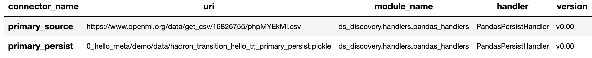

----------------

This gives a flavour of the tools available to look inside a component
and time should be taken viewing the different reports a component
offers.

Environment Variables
---------------------

To this point we have using the default settings of where to store the
Domain Contract and the persisted dataset. These are in general local
and within your working directory. The use of environment variables
frees us up to use an extensive list of connector contracts to store the
data to a location of the choice or requirements.

Hadron provides an extensive list of environment variables to tailor how
your components retrieve and persist their information, this is beyond
the scope of this tutorial and tend to be for specialist use, therefore
we are going to focus on the two most commonly used for the majority of
projects.

We initially import Python’s ``os`` package.

.. code:: ipython3

    import os

In general and as good practice, most notebooks would ``run`` a set up
file that contains imports and environment variables that are common
across all notebooks. In this case, for visibility, because this is a
tutorial, we will import the packages and set up the two environment
variables within each notebook.

The first environment variable we set up is for the location of the
Domain Contract, this is critical to the components and the other
components that rely on it (more of this later). In this case we are
setting the Domain Contract location to be in a common local directory
of our naming.

.. code:: ipython3

    os.environ['HADRON_PM_PATH'] = '0_hello_meta/demo/contracts'

The second environment variable is for the location of where the data is
to be persisted. This allows us to place data away from the working
files and have a common directory where data can be sourced or
persisted. This is also used internally within the component to avoid
having to remember where data is located.

.. code:: ipython3

    os.environ['HADRON_DEFAULT_PATH'] = '0_hello_meta/demo/data'

As a tip we can see where the default path environment variable is set
by using ``report_connectors``. By passing the parameter
``inc_template=True`` to the ``report_connectors`` method, showing us
the connector names. By each name is the location path (uri) where, by
default, the component will source or persist the data set, this is
taken from the environment variable set. Likewise we can see where the
Domain Contract is being persisted by including the parameter ``inc_pm``
giving the location path (uri) given by the environment variable.

.. code:: ipython3

    tr.report_connectors(inc_template=True)

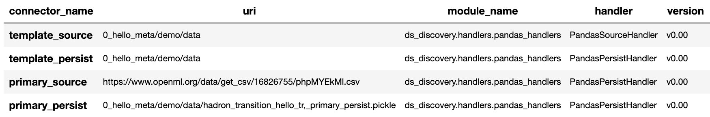

-------------------

Because we have now changed the location of where the Domain Contract
can be found we need to reset things from the start giving the source
location and using the default persist location which we now know has
been set by the environment variable.

.. code:: ipython3

    tr = Transition.from_env('hello_tr,', has_contract=False)

.. code:: ipython3

    tr.set_source_uri('https://www.openml.org/data/get_csv/16826755/phpMYEkMl.csv')
    tr.set_persist()

Finally we run the pipeline with the new environemt variables in place
and check everything runs okay.

.. code:: ipython3

    tr.run_component_pipeline()

And we are there! We now know how to build a component and set its
environment variables. The next step is to build a real pipeline and
join that with other pipelines to construct our complete master Domain
Contract.

Building a Component for Selection
==================================

Now we know what a component looks like we can start to build the
pipeline adding in actions that gives the component purpose.

The first component we will build as part of the pipeline is the data
selection component with the class name Transition. This component
provides a set of actions that focuses on tidying raw data by removing
data columns that are not useful to the final feature set. These may
include null columns, single value columns, duplicate columns and noise
etc. We can also ensure the data is properly canonicalised through
enforcing data typing.

Project Hadron Canonicalizes data following the canonical model pattern
so that every component speaks the same data language. In this case and
with this package all components use Pandas DataFrame format. This is
common format used by data scientists and statisticians to manipulate
and visualise large data sets.

Setting Up
----------

Before we do that, and as shown in the previous section, we now use the
environment variables to define the location of the Domain Contract and
datastore.

.. code:: ipython3

    import os

.. code:: ipython3

    os.environ['HADRON_PM_PATH'] = '0_hello_meta/demo/contracts'
    os.environ['HADRON_DEFAULT_PATH'] = '0_hello_meta/demo/data'

For the feature selection we are using the Transition component with the
ability to select the correct columns from raw data, potentially
reducing the column count. In addition the Transistioning component
extends the common reporting tools and provides additional functionality
for identifying quality, quantity, veracity and availability.

It should be worth noting we are creating a new component and as such
must set up the input and the output of the component.

.. code:: ipython3

    from ds_discovery import Transition

.. code:: ipython3

    # get the instance
    tr = Transition.from_env('hello_tr', has_contract=False)

.. code:: ipython3

    tr.set_source_uri('https://www.openml.org/data/get_csv/16826755/phpMYEkMl.csv')
    tr.set_persist()

Adding Select Actions
---------------------

At the core of a component is its tasks, in other words how it changes
incoming data into a different data outcome. To achieve this we use the
actions that are set up specificially for this Component. These actions
are the intensions of the specific component also know as the components
intent. The components intent is a finate set of methods, unique to each
component, that can be applied to the raw data in order to change it in
a way that is useful to the outcome of the task.

In order to get a list of a component’s intent, in this case feature
selection, you can use the Python method ``__dir__()``. In this case
with the transition component ``tr`` we would use the comand
``tr.tools.__dir__()``\ to produce the directory of the components
select intent. Remember this method call can be used in any components
intent tools.

Now we have added where the raw data is situated we can load the
canonical, called, ``df``\ …

.. code:: ipython3

    df = tr.load_source_canonical()

…and produce the report on the raw data so we can observe the features
of interest.

.. code:: ipython3

    tr.canonical_report(df)

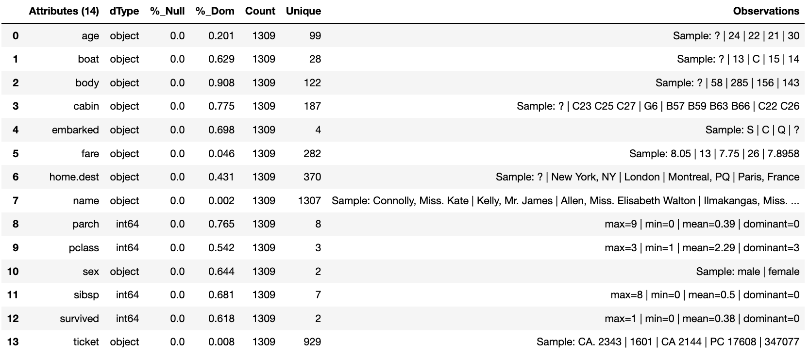

-------------------

Features of Interest
--------------------

The components intent methods are not first class methods but part of
the ``intent_model_class``. Therefore to access the intent specify the
controller instance name, in this case ``tr``, and then reference the
``intent_model_class`` to access the components intent. To make this
easier to remember with an abbreviated form we have overloaded the
``intent_model`` name with the name ``tools``. You can see with all
reference to the intent actions they start with ``tr.tools.``

When looking for features of interest, through observation, it appears,
within some columns ``space`` has been repalaced by a question mark
``?``. In this instance we would use the ``auto_reinstate_nulls`` to
replace all the obfusacted cells with nulls. In addition we can
immediately observe columns that are inappropriate for our needs. In
this case we do not need the column **name** and it is removed using
``to_remove`` passing the name of the attribute.

.. code:: ipython3

    # returns obfusacted nulls
    df = tr.tools.auto_reinstate_nulls(df, nulls_list=['?'])
    # removes data columns of no interest
    df = tr.tools.to_remove(df, headers=['name'])

Run Component Pipeline
----------------------

To run a component we use the common method ``run_component_pipeline``
which loads the source data, executes the component task then persists
the results. This is the only method you can use to run the tasks of a
component and produce its results and should be a familiarized method.

We can now run the ``run_component_pipeline`` and use the canonical
report to observe the outcome. From it we can see the nulls column now
indicates the number of nulls in each column correctly so we can deal
with them later. We have also removed the column **name**.

.. code:: ipython3

    tr.run_component_pipeline()
    tr.canonical_report(tr.load_persist_canonical())

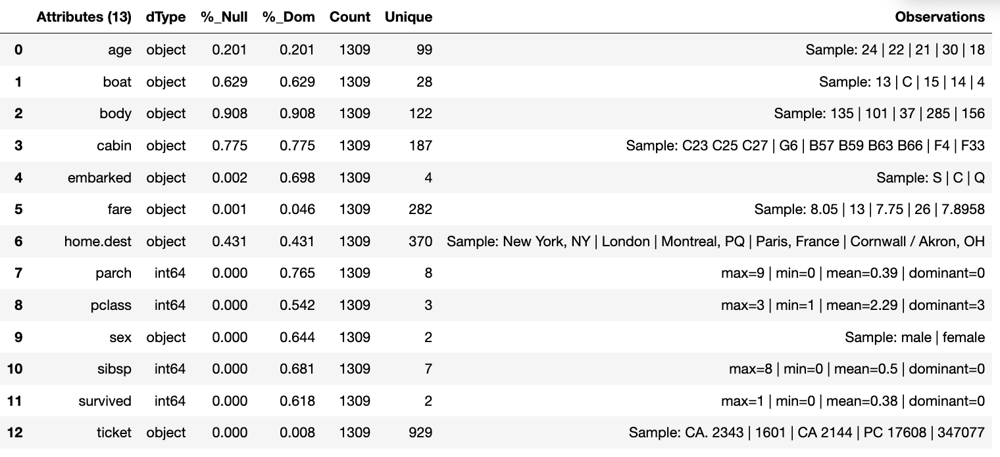

-------------------

As we continue the observations we see more columns that are of limited
interest and need to be removed as part of the selection process.
Because the components intent action is mutable we can re-implement the
``to_remove`` including the new headers within the list. As this
overwrites the original component intent we must make sure to include
the **name** Column.

.. code:: ipython3

    df = tr.tools.to_remove(df, headers=['name', 'boat', 'body', 'home.dest'])

As the target is a cluster algorithm we can use the ``auto_to_category``
to ensure the data **typing** is appropriate to the column type.

.. code:: ipython3

    df = tr.tools.auto_to_category(df, unique_max=20)

Finally we ensure the two contigious columns are set to numeric type. It
is worth noting though age is an interger, Python does not recognise
nulls within an interger type and automaticially choses it as a float
type.

.. code:: ipython3

    df = tr.tools.to_numeric_type(df, headers=['age', 'fare'])

Using the Intent reporting tool to check the work and see what the
Intent currently looks like all together.

.. code:: ipython3

    tr.report_intent()

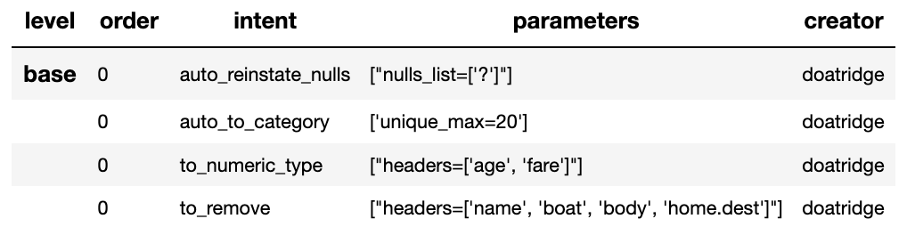

-------------------

Adding these actions or the components intent is a process of looking at
the raw data and the observer making decisions on the selection of the
features of interest. Therefore component selection is potentially an
iterative task where we would add component intent, observe the changes
and then repeat until the process is complete.

Ordering the Actions of a Component
-----------------------------------

With the component intent now defined the run pipeline does its best to
guess the best order of that Intent but sometimes we want to ensure
things run in a certain order due to dependancies or other challenges.
Though not necessary, we will clear the previous Intent and write it
again, this time in order.

.. code:: ipython3

    tr.remove_intent()

This time when we add the Intent we include the parameter
``intent_level`` to indicate the different order or level of execution.

We load the source canonical and repeat the Intent, this time including
the new intent level.

.. code:: ipython3

    df = tr.load_source_canonical()

.. code:: ipython3

    df = tr.tools.auto_reinstate_nulls(df, nulls_list=['?'], intent_level='reinstate')
    df = tr.tools.to_remove(df, headers=['name', 'boat', 'body', 'home.dest'], intent_level='remove')
    df = tr.tools.auto_to_category(df, unique_max=20, intent_level='auto_category')
    df = tr.tools.to_numeric_type(df, headers=['age', 'fare'], intent_level='to_dtype')
    df = tr.tools.to_str_type(df, headers=['cabin', 'ticket'],use_string_type=True , intent_level='to_dtype')

In addition, and as an introduction to a new feature, we will add in the
column description that describes the reasoning behind why an Intent was
added.

.. code:: ipython3

    tr.add_column_description('reinstate', description="reinstate nulls that where obfuscated with '?'")
    tr.add_column_description('remove', description="remove column of no value")
    tr.add_column_description('auto_category', description="auto fit features to categories where their uniqueness is 20 or less")
    tr.add_column_description('to_dtype', description="ensure all other columns of interest are appropriately typed")

Using the report we can see the addition of the numbers, in the level
column, which helps the run component run the tasks in the order given.
It is worth noting that the tasks can be given the same level if the
order is not important and the run component will deal with it using its
ordering algorithm.

.. code:: ipython3

    tr.report_intent()

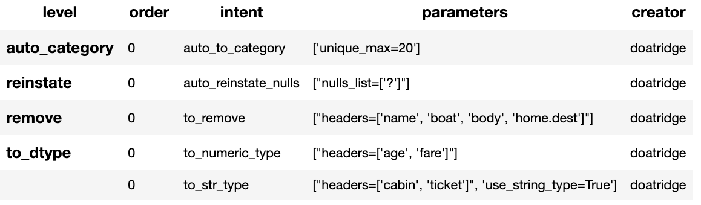

-------------------

As we have taken the time to capture the reasoning to include the
compoment Intent we can use the reports to produce a view of the Intent
column comments that are invaluable when interrogating a component and
understanding why decisions were made.

.. code:: ipython3

    tr.report_column_catalog()

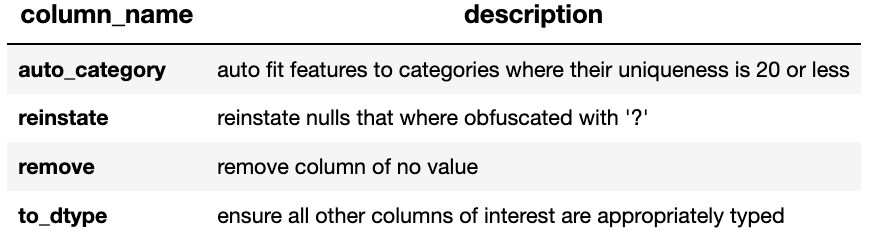

-------------------

Run Component
-------------

As usual we can now run the Component to apply the components
tasks.

.. code:: ipython3

    tr.run_component_pipeline()

As an extension of the default, ``run_component_pipeline`` provides
useful tools to help manage the outcome. In this case we’ve
specificially defined the Intent order we wanted to run.

.. code:: ipython3

    tr.run_component_pipeline(intent_levels=['remove', 'reinstate', 'auto_category', 'to_dtype'])

Run Books
---------

A challenge faced with the component intent is its order, as you have
seen. The solution thus far only applies at run time and is therefore
not repeatable. We introduced the idea of Run Books as a repeatable set
of instructions which contain the order in which to run the components
intent. Run Books also provide the ability to particially implement
component intent actions, meaning we can replay subsets of a fuller list
of a components intent. For example through experimentation we have
created a number of additional component intents, that are not pertinent
to a production ready selection. By setting up two Run Books we can
select which component intent is appropriate to their objectives and
``run_component_pipeline`` to produce the appropriate outcome.

In the example we add our list of intent to a book in the order needed.
In this case we have not specified a book name so this book is allocated
to the primary Run Book. Now each time we run pipeline, it is set to run
the primary Run Book.

.. code:: ipython3

    tr.add_run_book(run_levels=['remove', 'reinstate', 'auto_category', 'to_dtype'])

Here we had a book by name where we select only the intent that cleans
the raw data. The Run book report Now what are shows us the two run
books;

.. code:: ipython3

    tr.add_run_book(book_name='cleaner', run_levels=['remove', 'reinstate'])

.. code:: ipython3

    tr.report_run_book()

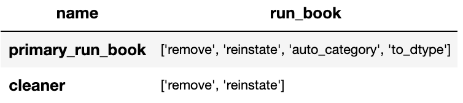

-------------------

In this next example we add an additional Run Book that is a subset of
the tasks to only clean the data. By passing this named Run Book to the
run pipeline it is obliged to only run this subset and only clean the
data. We can see the results of this in our canonical report below.

.. code:: ipython3

    tr.run_component_pipeline(run_book='cleaner')

.. code:: ipython3

    tr.canonical_report(tr.load_persist_canonical())

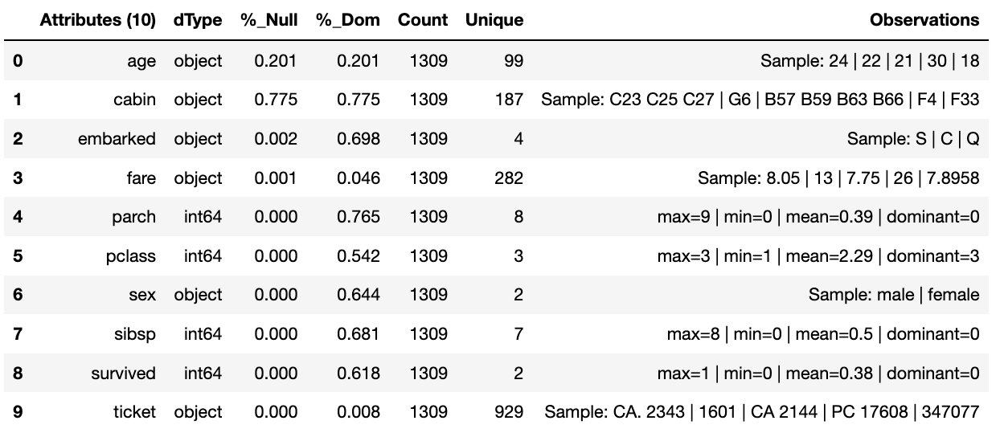

..

As a contrast to the above we can run the pipeline without providing a
Run Book name and it will automatically default to the primary run book,
assuming this has been set up. In this case running the full component
Intent the resulting outcome is shown below in the canonical report.

.. code:: ipython3

    tr.run_component_pipeline()

.. code:: ipython3

    tr.canonical_report(tr.load_persist_canonical())

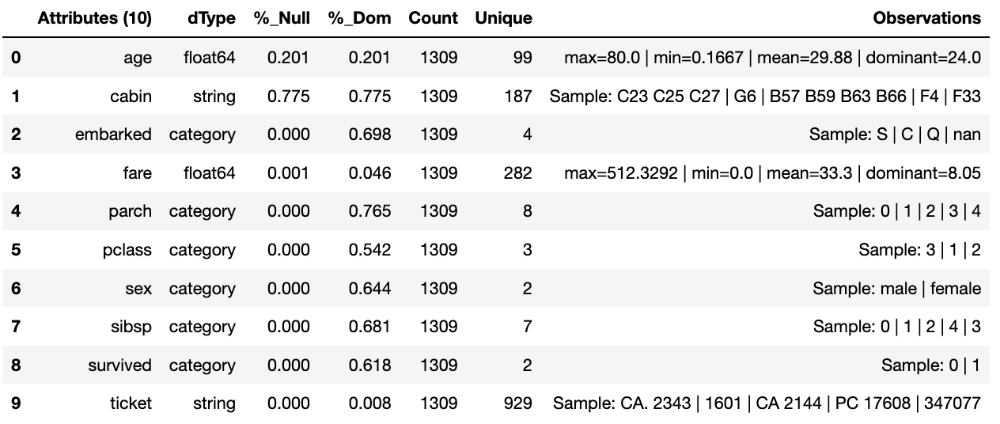

-------------------

Building a Component for Engineering
====================================

This new component works in exactly the same way as the selection
component, whereby we create the instance pertinent to our intentions,
give it a location to retrieve data from, the source, and where to
persist the results. Then we add the component intent, which in this
case is to engineer the features we have selected and make them
appropriate for a machine learning model or for further investigation.

Setting Up
----------

.. code:: ipython3

    import os

.. code:: ipython3

    os.environ['HADRON_PM_PATH'] = '0_hello_meta/demo/contracts'
    os.environ['HADRON_DEFAULT_PATH'] = '0_hello_meta/demo/data'

For feature engineering the component we will use, that contains the
feature engineering intent, is called ``wrangle``.

.. code:: ipython3

    from ds_discovery import Wrangle, Transition

.. code:: ipython3

    # get the instance
    wr = Wrangle.from_env('hello_wr', has_contract=False)

With the source we want to be able to retrieve the outcome of the
previous select component as this contains the selected features of
interest. In order to retrieve this information we need to access the
select components Domain Contract, remember this holds all the knowledge
for any component. As this is a common thing to do there is a First
class method call ``get_persist_contract`` that can be called directly.

To retrieve the name of the source we are interested in we reload the
previous component ``Transition`` giving it the unique name we used when
creating the select component, in this case ``hello_wr``, this loads the
select components Domain Contract and then ``get_persist_contract``
which returns the string value of the outcome of that select component.

.. code:: ipython3

    source = Transition.from_env('hello_tr').get_persist_contract()
    wr.set_source_contract(source)
    wr.set_persist()

As a check we can run the canonical report and see that we have loaded
the output of the previous component (Transition component) into the
current source.

.. code:: ipython3

    df = wr.load_source_canonical()

.. code:: ipython3

    wr.canonical_report(df)

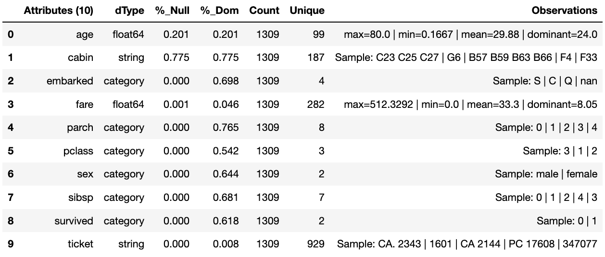

-------------------

Engineering the Features
------------------------

As mentioned in the previous component demo, the components intent
methods are not first class methods but part of the intent_model_class.
Therefore to access the intent specify the controller instance name, in
this case tr, and then reference the intent_model_class to access the
components intent. To make this easier to remember with an abbreviated
form we have overloaded the intent_model name with the name tools. You
can see with all reference to the intent actions they start with
tr.tools.

Now we have the source we can deal with the feature Engineering. As this
is for the purpose of demonstration we are only sampling a small
selection of Intent methods. It is well worth looking through the other
Intent methods to get to know the full extent of the feature engineering
package.

To get started, the column name ``sibsip``, the number of siblings or
the spouse of a person onboard, and ``parch``, the number of parents or
children each passenger was touring with, added together provide a new
value that provides the size of each family.

.. code:: ipython3

    df['family'] = wr.tools.correlate_aggregate(df, headers=['parch', 'sibsp'], agg='sum', column_name='family')

The column name ``cabin`` provides us with a record of the cabin each
passenger was allocated. Taking the first letter from each cabin gives
us the deck the passenger was on. This provides us with a useful
catagorical.

.. code:: ipython3

    df['deck'] = wr.tools.correlate_custom(df, code_str="@['cabin'].str[0]", column_name='deck')

We also note that a passenger travelling alone seems to have an improved
survival rate. By selecting ``family``, who’s value is one and giving
all other values a zero we can create a new column ``is_alone`` that
indicates passengers travelling on their own.

.. code:: ipython3

    selection = [wr.tools.select2dict(column='family', condition='@==0')]
    df['is_alone'] = wr.tools.correlate_selection(df, selection=selection, action=1, default_action=0, column_name='is_alone')

Finally we ensure each of our new features are appropriately ``typed``
as a category. We also want to ensure the change to catagory runs after
the newly created columns so we add the parameter ``intent_order`` with
a value of one.

.. code:: ipython3

    df = wr.tools.model_to_category(df, headers=['family','deck','is_alone'], intent_order=1, column_name='to_category')

By running the Intent report we can observe the change of order of the
intent level.

.. code:: ipython3

    wr.report_intent()

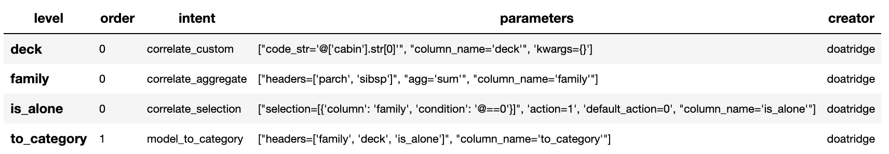

-------------------

Run Component
-------------

To run a component we use the common method ``run_component_pipeline``
which loads the source data, executes the component task , in this case
components intent, then persists the results. This is the only method
you can use to run the tasks of a component and produce its results and
should be a familiarized method.

At this point we can run the pipeline and see the results of the new
features.

.. code:: ipython3

    wr.run_component_pipeline()

.. code:: ipython3

    wr.canonical_report(df)

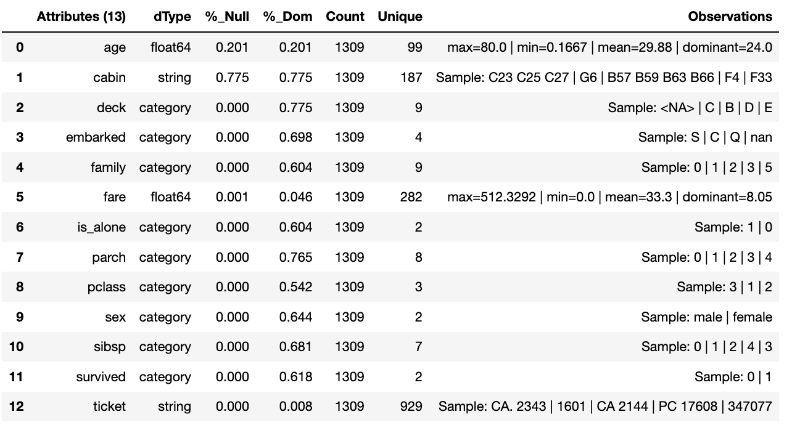

-------------------

Imputation
----------

Imputation is the act of replacing missing data with statistical
estimates of the missing values. The goal of any imputation technique is
to produce a complete dataset that can be used to train machine learning
models. There are three types of missing data: - Missing Completely at
Random (MCAR); where the missing data has nothing to do with another
feature(s) - Missing at Random (MAR); where missing data can be
interpreted from another feature(s) - Missing not at Random (MNAR);
where missing data is not random and can be interpreted from another
feature(s)

With ``deck`` and ``fair`` we can assume MCAR but with ``age`` it
appears to have association with other features. But for the purposes of
the demo we are going to assume it to also be MCAR.

With ``deck`` the conversion to catagorical has already imputed the
nulls with the new catagorical value therefore we do not need to do
anything.

.. code:: ipython3

    df['deck'].value_counts()

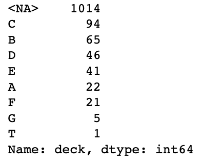

-------------------

With ``fare`` we chose a random number whereby this number is more
likely to fall within a populated area and preserves the distribution of
the data. This works particulary well with the small amount of missing
data.

.. code:: ipython3

    df['fare'] = wr.tools.correlate_missing(df, header='fare', method='random', column_name='fare')

Age is slightly more tricky as its null values are quite large. In this
instance we will use probability frequency, which like random values
preserves the distribution of the data. Quite often, in these cases, we
can add an additional boulean column that tells us which values were
generated to replace nulls.

.. code:: ipython3

    df['age'] = wr.tools.correlate_missing_weighted(df, header='age', granularity=5.0, column_name='age')

Using the Intent report we can check on the additional intent added.

.. code:: ipython3

    wr.report_intent()

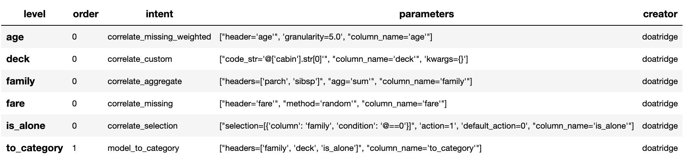

-------------------

Run Book
~~~~~~~~

We have touched on Run Book before where by the Run Book allows us to
define a run order that is preserved longer term. With the need for
``to_category`` to run as the final intent the Run Book fulfills this
perfectly.

Adding a Run Book is a simple task of listing the intent in the order in
which you wish it to run. As discussed before we are using the default
Run Book which will automatically be picked up by the run component as
its run order.

.. code:: ipython3

    wr.add_run_book(run_levels=['age','deck','family','fare','is_alone','to_category'])

.. code:: ipython3

    wr.run_component_pipeline()

Finially we can finish off by checking the Run Book with the Run Book
report and produce the Canonical Report to see the changes the feature
engineering has made.

.. code:: ipython3

    wr.report_run_book()

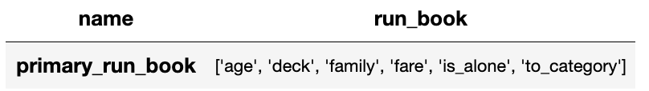

-------------------

.. code:: ipython3

    wr.canonical_report(wr.load_persist_canonical(), stylise=False)

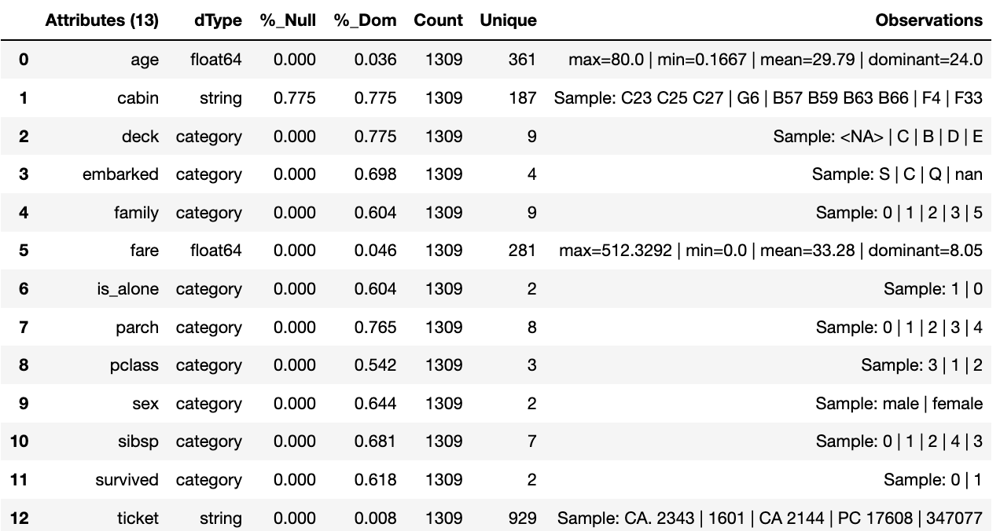

-------------------

Building a Component Controller
===============================

The Controller is a unique component that independently orchestrates the
components registered to it. It executes the components Domain Contract
and not its code. Domain Contracts belonging to a Controller should be
in the same path location as the Controllers Domain Contract. The
Controller executes the registered Controllers Domain Contracts in
accordance to the instructions given to it when the ``run_components``
is executed. The Controller orchestrates how those components should run
with the components being independant in their actions and therefore a
separation of concerns. With Controller you do not need to give it a
name as this is assumed in each folder containing Domain Contracts for
this set of components, known as a Domain Contract Cluster. This allows
us the entry point to interogate the Controller and its components.

Setting Up
----------

.. code:: ipython3

    import os

.. code:: ipython3

    os.environ['HADRON_PM_PATH'] = '0_hello_meta/demo/contracts'
    os.environ['HADRON_DEFAULT_PATH'] = '0_hello_meta/demo/data'

.. code:: ipython3

    from ds_discovery import Controller

.. code:: ipython3

    controller = Controller.from_env(has_contract=False)

Add Components
--------------

Now we have the empty Controller we need to register or add which
components make up this Controller, it should be noted that the Domain
Contracts for each component must be in the same folder of the
Controller Domain Contract.

To add a component we use the intent method specific for that component
type in this case ``model_transition`` for ``hello_tr`` and
``model_wrangle`` for ``hello_wr``.

.. code:: ipython3

    controller.intent_model.transition(canonical=0, task_name='hello_tr', intent_level='hw_transition')

.. code:: ipython3

    controller.intent_model.wrangle(canonical=0, task_name='hello_wr', intent_level='hw_wrangle')

Report
------

Using the Task report we can check the components have been added.

.. code:: ipython3

    controller.report_tasks()

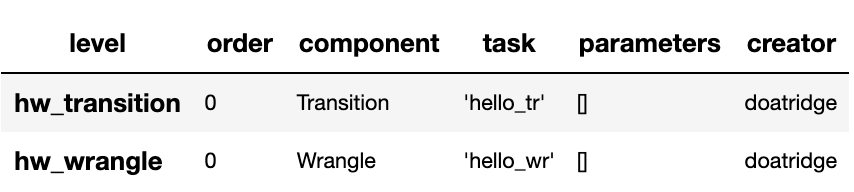

-------------------

As with all components the Controller executes the components in the
order given. By using the Controller’s special Run Book we are given
considerabily more flexability in the order and behaviour of each
component and how it interacts with others.

As good practice a Run Book should always be created for each Controller
as this provides better transparency into how the components run.

.. code:: ipython3

    run_book = [
        controller.runbook2dict(task='hw_transition'),
        controller.runbook2dict(task='hw_wrangle'),
    ]
    controller.add_run_book(run_levels=run_book)

Run Controller Pipeline
-----------------------

To run the controller we execute ``run_controller`` this is a special
method and replaces ``run_component_pipeline``, common to other
components, adding extra features to enable the control of the
registared components. This is the only method you can use to run the
Controller and execute its registared components. It is worth noting it
is the components that produce the outcome of their collective
objectives or tasks and not the Controller. The Controller orchestrates
how those components should run with the components being independant in
their actions and therefore a separation of concerns.

.. code:: ipython3

    controller.run_controller()

The Controller is a powerful tool and should be investigated further to
understand all its options. The Run Book can be used to provide a set of
instructions on how each component recieves its source and persists, be
it to another component or as an external data set. The
``run_controller`` has useful tools to monitor changes in incoming data
and provide a run report of how all the components ran.

--------------

In the section below we will demonstrate a couple of these features.

One of the most useful parameters that comes with the ``run_controller``
is the ``run_cycle_report`` that saves off a run report, that provides
the run time of the controller and the components there in.

.. code:: ipython3

    controller.run_controller(run_cycle_report='cycle_report.csv')
    controller.load_canonical(connector_name='run_cycle_report')

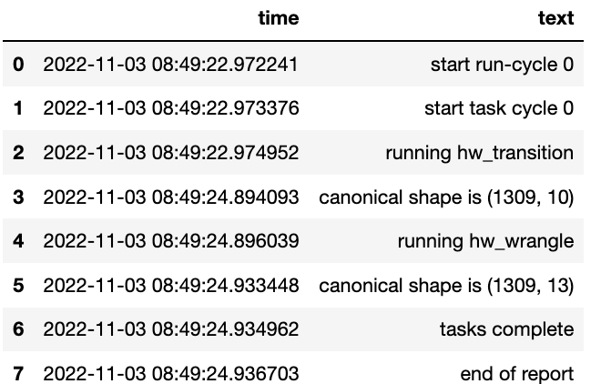

-------------------

Now we have the ``run_cycle_report`` we can observe the other
parameters. In this case we are adding the ``run_time`` parameter that
runs the controllers components for a time period of three seconds

.. code:: ipython3

    controller.run_controller(run_time=3, run_cycle_report='cycle_report.csv')
    controller.load_canonical(connector_name='run_cycle_report')

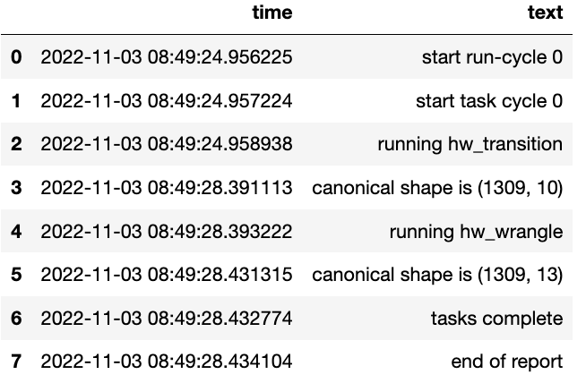

-------------------

In this example we had the parameters ``repeat`` and ``sleep`` where the
first defines the number of times to repeat the component cycleand the
second, and the number of seconds to pause between each cycle.

.. code:: ipython3

    controller.run_controller(repeat=2, sleep=3, run_cycle_report='cycle_report.csv')
    controller.load_canonical(connector_name='run_cyclHelloe_report')

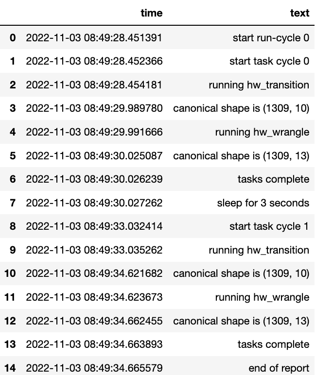

-------------------

Finally we use the ``source_check_uri`` parameter as a pointer to and
input source to watch for changes.

.. code:: ipython3

    controller.run_controller(repeat=3, source_check_uri='https://www.openml.org/data/get_csv/16826755/phpMYEkMl.csv', run_cycle_report='cycle_report.csv')
    controller.load_canonical(connector_name='run_cycle_report')

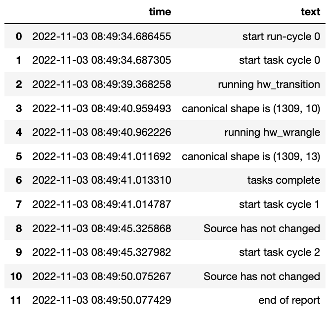

Reference
=========

Python version
--------------

Python 3.7 or less is not supported. Although it is recommended to install ``discovery-transition-ds`` against the
latest Python version or greater whenever possible.

Pandas version
--------------

Pandas 1.0.x and above are supported but It is highly recommended to use the latest 1.0.x release as the first
major release of Pandas.

GitHub Project
--------------
discovery-transition-ds: `<https://github.com/Gigas64/discovery-transition-ds>`_.

Change log
----------

See `CHANGELOG <https://github.com/doatridge-cs/discovery-transition-ds/blob/master/CHANGELOG.rst>`_.

Licence
-------

BSD-3-Clause: `LICENSE <https://github.com/doatridge-cs/discovery-transition-ds/blob/master/LICENSE.txt>`_.

Authors
-------

`Gigas64`_  (`@gigas64`_) created discovery-transition-ds.

.. _pip: https://pip.pypa.io/en/stable/installing/
.. _Github API: http://developer.github.com/v3/issues/comments/#create-a-comment
.. _Gigas64: http://opengrass.io
.. _@gigas64: https://twitter.com/gigas64

