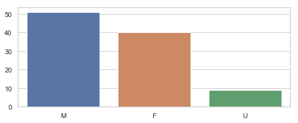
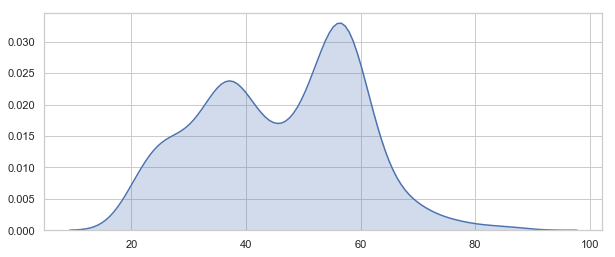
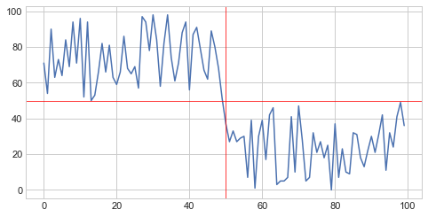
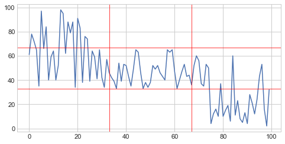
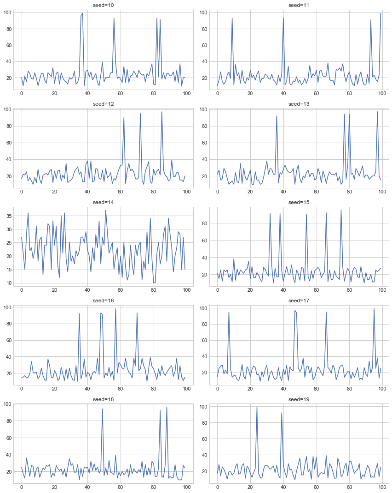
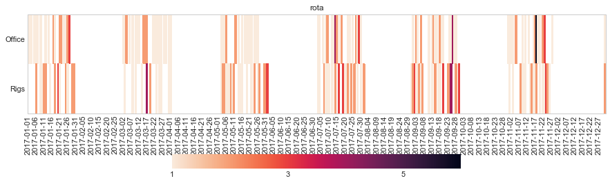
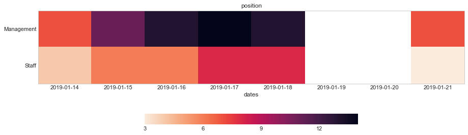

.. code:: ipython3

    # saves you having to use print as all exposed variables are printed in the cell
    from IPython.core.interactiveshell import InteractiveShell
    InteractiveShell.ast_node_interactivity = "all"
    
    # core libraries
    import numpy as np
    import pandas as pd
    import matplotlib.pyplot as plt
    import matplotlib.dates as mdates
    import seaborn as sns
    
    # matpolitlib config
    %matplotlib inline
    plt.rcParams['figure.figsize'] = 12,4
    
    # suppress warning message
    import warnings
    warnings.filterwarnings('ignore')
    
    import ds_discovery
    print('DTU: {}'.format(ds_discovery.__version__))

.. parsed-literal::

    DTU: 1.04.050

Geeting Started with DTU Synthetic Behavioural Data Builder
===========================================================

Package Structure
-----------------

Within the Discovery Transitioning Utils are a set
of\ ``simulator package`` that contains the DataBuilder,
DataBuilderPropertyManager and the DataBuilderTools class

DataBuilder:
^^^^^^^^^^^^

-  is a Data Builder management instance that allows the building of
   datasets to be repeatable by saving a configuration of the build
   definition

DataBuilderPropertyManager:
^^^^^^^^^^^^^^^^^^^^^^^^^^^

-  manages the configuration property values and saves the build
   templates to regenerate the synthetic data

DataBuilderTools:
^^^^^^^^^^^^^^^^^

-  is a set of static methods that generate the different data types
   ``int``, ``float``, ``string``, ``category`` and ``date``. and define
   the randomness and patterns of the values.

Firstly we need to import the ``DataBuilder`` class and create a
**named** instance to identify this instance from other instances we
might create. Normally the name would be representative of the dataset
you are trying to create such as ``customer``, ``accounts`` or
``transactions`` as an example

.. code:: ipython3

    from ds_discovery.simulators.data_builder import DataBuilder

.. code:: ipython3

    builder = DataBuilder('SimpleExample')

Building a basic dataset
------------------------

with this example we will firstly look at the tools that are avaialbe
and produce a ``Pandas DataFrame`` on the fly

.. code:: ipython3

    builder.tool_dir

.. parsed-literal::

    ['associate_custom',
     'associate_dataset',
     'correlate_categories',
     'correlate_dates',
     'correlate_numbers',
     'get_category',
     'get_column_csv',
     'get_custom',
     'get_datetime',
     'get_distribution',
     'get_names',
     'get_number',
     'get_string_pattern',
     'unique_date_seq',
     'unique_identifiers',
     'unique_numbers',
     'unique_str_tokens']

Here we can see the methods are broken down into four categories:
``get``, ``unique``, ``correlate``, ``associate``.

We can also look at the contextual help for each of the methods calling
the ``tools`` property and using the ``help`` build-in

.. code:: ipython3

    help(builder.tools.get_number)

.. parsed-literal::

    Help on function get_number in module ds_discovery.simulators.data_builder:
    
    get_number(to_value: [<class 'int'>, <class 'float'>], from_value: [<class 'int'>, <class 'float'>] = None, weight_pattern: list = None, precision: int = None, size: int = None, quantity: float = None, seed: int = None)
        returns a number in the range from_value to to_value. if only to_value given from_value is zero
        
        :param to_value: highest integer value, if from_value provided must be one above this value
        :param from_value: optional, (signed) integer to start from. Default is zero (0)
        :param weight_pattern: a weighting pattern or probability that does not have to add to 1
        :param precision: the precision of the returned number. if None then assumes int value else float
        :param size: the size of the sample
        :param quantity: a number between 0 and 1 representing data that isn't null
        :param seed: a seed value for the random function: default to None
        :return: a random number
    

From here we can now play with some of the ``get`` methods

.. code:: ipython3

    # get an integer between 0 and 9
    builder.tools.get_number(10, size=5)

.. parsed-literal::

    [6, 5, 3, 2, 3]

.. code:: ipython3

    # get a float between -1 and 1, notice by passing an float it assumes the output to be a float
    builder.tools.get_number(from_value=-1.0, to_value=1.0, precision=3, size=5)

.. parsed-literal::

    [0.283, 0.296, -0.958, 0.185, 0.831]

.. code:: ipython3

    # get a timestamp between two dates
    builder.tools.get_datetime(start='01/01/2017', until='31/12/2018')

.. parsed-literal::

    [Timestamp('2018-02-11 02:23:32.733296768')]

.. code:: ipython3

    # get a formated date string between two numbers
    builder.tools.get_datetime(start='01/01/2017', until='31/12/2018', size=4, date_format='%d-%m-%Y')

.. parsed-literal::

    ['06-06-2017', '05-11-2017', '28-09-2018', '04-11-2017']

.. code:: ipython3

    # get categories from a selection
    builder.tools.get_category(['Red', 'Blue', 'Green', 'Black', 'White'], size=4)

.. parsed-literal::

    ['Green', 'Blue', 'Blue', 'White']

.. code:: ipython3

    # get unique categories from a selection
    builder.tools.get_category(['Red', 'Blue', 'Green', 'Black', 'White'], size=4, replace=False)

.. parsed-literal::

    ['Blue', 'White', 'Green', 'Black']

Building a DataFrame
~~~~~~~~~~~~~~~~~~~~

With these lets build a quick Synthetic DataFrame. For ease of code we
will redefine the 'builder.tools' call

.. code:: ipython3

    tools = builder.tools

.. code:: ipython3

    # the dataframe has a unique id, a float value between 0.0 and 1.0and a date formtted as a text string
    df = pd.DataFrame()
    df['id'] = tools.unique_numbers(start=10, until=100, size=10)
    df['values'] = tools.get_number(to_value=1.0, size=10)
    df['date'] = tools.get_datetime(start='12/05/2018', until='30/11/2018', date_format='%d-%m-%Y %H:%M:%S', size=10)

Data quantity
~~~~~~~~~~~~~

to show representative data we can adjust the quality of the data we
produce. Here we only get about 50% of the telephone numbers

.. code:: ipython3

    # using the get string pattern we can create part random and part static data elements. see the inline docs for help on customising choices
    df['mobile'] = tools.get_string_pattern("(07ddd) ddd ddd", choice_only=False, size=10, quantity=0.5)
    df

.. raw:: html

    

    
    <table border="1" class="dataframe">
      <thead>
        <tr style="text-align: right;">
          <th></th>
          <th>id</th>
          <th>values</th>
          <th>date</th>
          <th>mobile</th>
        </tr>
      </thead>
      <tbody>
        <tr>
          <th>0</th>
          <td>36</td>
          <td>0.344</td>
          <td>19-10-2018 12:02:31</td>
          <td>(07670) 153 948</td>
        </tr>
        <tr>
          <th>1</th>
          <td>11</td>
          <td>0.795</td>
          <td>03-07-2018 08:20:53</td>
          <td>(07408) 997 442</td>
        </tr>
        <tr>
          <th>2</th>
          <td>78</td>
          <td>0.681</td>
          <td>30-05-2018 17:39:56</td>
          <td></td>
        </tr>
        <tr>
          <th>3</th>
          <td>47</td>
          <td>0.841</td>
          <td>18-05-2018 07:21:55</td>
          <td>(07269) 653 602</td>
        </tr>
        <tr>
          <th>4</th>
          <td>21</td>
          <td>0.184</td>
          <td>05-09-2018 22:55:28</td>
          <td></td>
        </tr>
        <tr>
          <th>5</th>
          <td>85</td>
          <td>0.329</td>
          <td>09-06-2018 19:36:45</td>
          <td></td>
        </tr>
        <tr>
          <th>6</th>
          <td>89</td>
          <td>0.400</td>
          <td>18-08-2018 00:17:16</td>
          <td>(07401) 502 354</td>
        </tr>
        <tr>
          <th>7</th>
          <td>91</td>
          <td>0.436</td>
          <td>06-11-2018 00:11:17</td>
          <td>(07104) 249 395</td>
        </tr>
        <tr>
          <th>8</th>
          <td>61</td>
          <td>0.441</td>
          <td>19-10-2018 06:47:56</td>
          <td></td>
        </tr>
        <tr>
          <th>9</th>
          <td>30</td>
          <td>0.452</td>
          <td>27-11-2018 13:16:47</td>
          <td></td>
        </tr>
      </tbody>
    </table>
    

Weighted Patterns
-----------------

Now we can get a bit more controlled in how we want the random numbers
to be generated by using the weighted patterns. Weighted patterns are
similar to probability but don't need to add to 1 and also don't need to
be the same size as the selection. Lets see how this works through an
example.

lets generate an array of 100 and then see how many times each category
is selected

.. code:: ipython3

    selection = ['M', 'F', 'U']
    gender = tools.get_category(selection, weight_pattern=[5,4,1], size=100)
    dist = [0]*3
    for g in gender:
        dist[selection.index(g)] += 1
    
    print(dist)

.. parsed-literal::

    [51, 40, 9]

.. code:: ipython3

    fig = plt.figure(figsize=(8,3))
    sns.set(style="whitegrid")
    g = sns.barplot(selection, dist)

It can also be used to create more complex distribution. In this example
we want an age distribution that has peaks around 35-40 and 55-60 with a
significant tail off after 60 but don't want a probability for every
age.

.. code:: ipython3

    # break the pattern into every 5 years
    pattern = [3,5,6,10,6,5,7,15,5,2,1,0.5,0.2,0.1]
    age = tools.get_number(20, 90, weight_pattern=pattern, size=1000)
    
    fig = plt.figure(figsize=(10,4))
    _ = sns.set(style="whitegrid")
    _ = sns.kdeplot(age, shade=True)

Complex Weighting patterns
~~~~~~~~~~~~~~~~~~~~~~~~~~

Weighting patterns acn be multi dimensial representing controlling
distribution over time.

In this example we don't want there to be any values below 50 in the
first half then only values below 50 in the second

.. code:: ipython3

    split_pattern = [[0,1],[1,0]]
    numbers = tools.get_number(100, weight_pattern=split_pattern, size=100)
    
    fig = plt.figure(figsize=(8,4))
    plt.style.use('seaborn-whitegrid')
    plt.plot(list(range(100)), numbers);
    _ = plt.axhline(y=50, linewidth=0.75, color='red')
    _ = plt.axvline(x=50, linewidth=0.75, color='red')

.. parsed-literal::

    [<matplotlib.lines.Line2D at 0x1a242ae320>]

we can even build more complex numbering where we always get numbers
around the middle but first 3rd and last 3rd additionally high and low
numbersrespectively

.. code:: ipython3

    mid_pattern = [[0,0,1],1,[1,0,0]]
    numbers = tools.get_number(100, weight_pattern=mid_pattern, size=100)
    fig = plt.figure(figsize=(8,4))
    _ = plt.plot(list(range(100)), numbers);
    _ = plt.axhline(y=33, linewidth=0.75, color='red')
    _ = plt.axhline(y=67, linewidth=0.75, color='red')
    _ = plt.axvline(x=33, linewidth=0.75, color='red')
    _ = plt.axvline(x=67, linewidth=0.75, color='red')

Random Seed
~~~~~~~~~~~

in this example we are using seeding to fix predictability of the
randomness of both the weighted pattern and the numbers generated. We
can then look for a good set of seeds to generate different spike
patterns we can predict.

.. code:: ipython3

    fig = plt.figure(figsize=(12,15))
    right=False
    for i in range(0,10): 
        ax = plt.subplot2grid((5,2),(int(i/2), int(right)))
        result = tools.get_number(100, weight_pattern=np.sin(range(10)), size=100, seed=i+10)
        g = plt.plot(list(range(100)), result);
        t = plt.title("seed={}".format(i+10))
        right = not right
    plt.tight_layout()
    plt.show()

Dates
-----

Dates are an important part of most datasets and need flexibility in all
theri mutidimentional elements

.. code:: ipython3

    # creating a set of randome dates and a set of unique dates
    df = pd.DataFrame()
    df['dates'] =  tools.get_datetime('01/01/2017', '21/01/2017', size=20, date_format='%d-%m-%Y')
    df['seq'] = tools.unique_date_seq('01/01/2017', '21/01/2017', size=20, date_format='%d-%m-%Y')
    print("{}/20 dates and {}/20 unique date sequence".format(df.dates.nunique(), df.seq.nunique()))

.. parsed-literal::

    11/20 dates and 20/20 unique date sequence

Date patterns
~~~~~~~~~~~~~

Get Data has a number of different weighting patterns that can be
applied - accross the daterange - by year - by month - by weekday - by
hour - by minutes

Or by a combination of any of them.

.. code:: ipython3

    from ds_discovery.transition.discovery import Visualisation as visual

.. code:: ipython3

    # Create a month pattern that has no data in every other month
    pattern = [1,0]*6
    selection = ['Rigs', 'Office']
    
    df_rota = pd.DataFrame()
    df_rota['rota'] = tools.get_category(selection, size=300)
    df_rota['dates'] =  tools.get_datetime('01/01/2017', '01/01/2018', size=300, month_pattern=pattern)
    
    df_rota = cleaner.to_date_type(df_rota, headers='dates')
    df_rota = cleaner.to_category_type(df_rota, headers='rota')

.. code:: ipython3

    visual.show_cat_time_index(df_rota, 'dates', 'rota')

.. parsed-literal::

    <Figure size 432x288 with 0 Axes>

Quite often dates need to have specific pattern to represent real
working times, in this example we only want dates that occur in the
working week.

.. code:: ipython3

    # create dates that are only during the working week
    pattern = [1,1,1,1,1,0,0]
    selection = ['Management', 'Staff']
    
    df_seating = pd.DataFrame()
    df_seating['position'] = tools.get_category(selection, weight_pattern=[7,3], size=100)
    df_seating['dates'] =  tools.get_datetime('14/01/2019', '22/01/2019', size=100, weekday_pattern=pattern)
    
    df_seating = cleaner.to_date_type(df_seating, headers='dates')
    df_seating = cleaner.to_category_type(df_seating, headers='position')

.. code:: ipython3

    visual.show_cat_time_index(df_seating, 'dates', 'position')

.. parsed-literal::

    <Figure size 432x288 with 0 Axes>

.. code:: ipython3

    
    help(tools.get_datetime)

.. parsed-literal::

    Help on function get_datetime in module ds_discovery.simulators.data_builder:
    
    get_datetime(start: [<class 'str'>, <module 'datetime' from '/Users/doatridge/anaconda3/lib/python3.7/datetime.py'>, <class 'datetime.datetime'>, <class 'pandas._libs.tslibs.timestamps.Timestamp'>], until: [<class 'str'>, <module 'datetime' from '/Users/doatridge/anaconda3/lib/python3.7/datetime.py'>, <class 'datetime.datetime'>, <class 'pandas._libs.tslibs.timestamps.Timestamp'>], default: [<class 'str'>, <module 'datetime' from '/Users/doatridge/anaconda3/lib/python3.7/datetime.py'>, <class 'datetime.datetime'>, <class 'pandas._libs.tslibs.timestamps.Timestamp'>] = None, ordered: bool = None, date_pattern: list = None, year_pattern: list = None, month_pattern: list = None, weekday_pattern: list = None, hour_pattern: list = None, minute_pattern: list = None, quantity: float = None, date_format: str = None, size: int = None, seed: int = None, day_first: bool = True, year_first: bool = False)
        returns a random date between two date and times. weighted patterns can be applied to the overall date
        range, the year, month, day-of-week, hours and minutes to create a fully customed random set of dates.
        Note that if no patterns are se this will return a linearly random number betyween the range boundaries
        
        :param start: the start boundary of the date range to select from
        :param until: then up until boundary of the date range to select from
        :param default: (optional) the default starting date that changes are applied to. if None then a random
        :param ordered: (optional) if the return list should be date ordered
        :param date_pattern: (optional) A pattern across the whole date range.
                If set, is the primary pattern with each subsequent pattern overriding this result
                If no other pattern is set, this will return a random date based on this pattern
        :param year_pattern: (optional) adjusts the year selection to this pattern
        :param month_pattern: (optional) adjusts the month selection to this pattern. Must be of length 12
        :param weekday_pattern: (optional) adjusts the weekday selection to this pattern. Must be of length 7
        :param hour_pattern: (optional) adjusts the hours selection to this pattern. must be of length 24
        :param minute_pattern: (optional) adjusts the minutes selection to this pattern
        :param quantity: the quantity of values that are not null. Number between 0 and 1
        :param date_format: the format of the date to be returned. default '%d-%m-%Y'
        :param size: the size of the sample to return. Default to 1
        :param seed: a seed value for the random function: default to None
        :param year_first: specifies if to parse with the year first
                If True parses dates with the year first, eg 10/11/12 is parsed as 2010-11-12.
                If both dayfirst and yearfirst are True, yearfirst is preceded (same as dateutil).
        :param day_first: specifies if to parse with the day first
                If True, parses dates with the day first, eg %d-%m-%Y.
                If False default to the a prefered preference, normally %m-%d-%Y (but not strict)
        :return: a date or size of dates in the format given.
    

